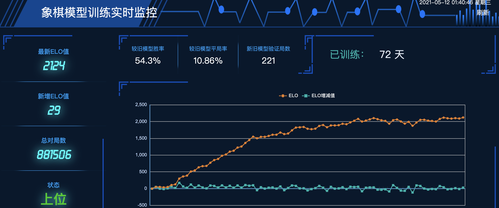
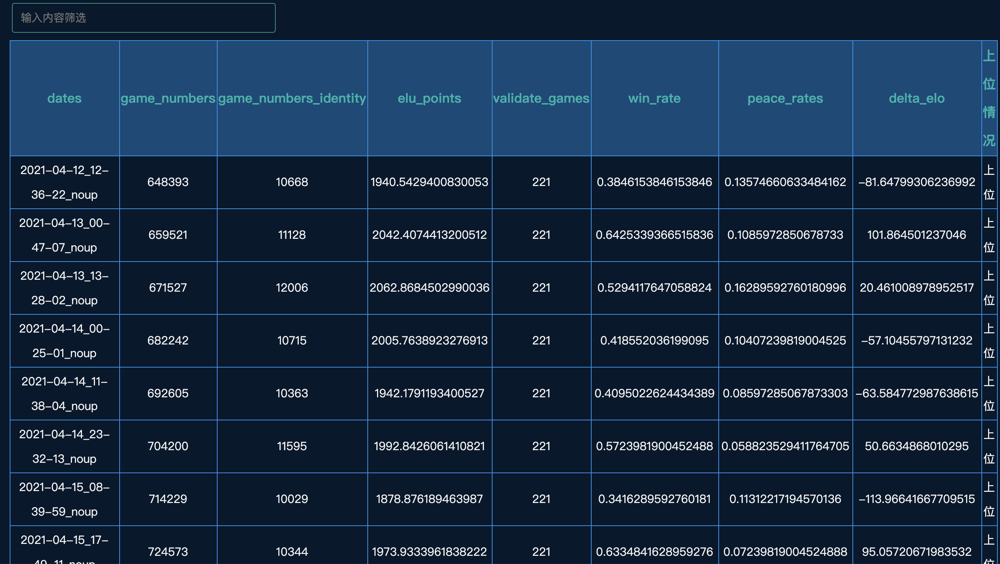

# 中国象棋Alpha Zero

这个项目学习了Alpha Zero纯强化学习的训练模式，采用蒙特卡洛树搜索和残差神经网络相结合的方式，使用TensorFlow框架，进行了Master-Slave架构的分布式强化学习训练，做出了一个具有可玩性和较强棋力的象棋游戏。
目前的elo：



详细胜率表：



当然，目前棋力还比较一般，因为是从完全随机开始训练的，比方说某个对局片段(800 playouts)：


# 项目结构
- chess_web文件夹下是以Flask为后端，BootStrap和Echarts为前端的训练过程可视化的Web代码，也就是上面的ELO值曲线以及胜率表所展现的网页。运行环境在**该文件夹下**的requirements.txt中。
- chess_vue文件夹下是在线网页象棋游戏的Web代码，以Vue为前端，后台开在服务器上的Restful风格的网页。网址是：http://m.reimu.host:5005/ 。服务器在学校里，如果碰到放假或者断电，服务器没有正常运行的话，网页会无法打开。
- cchess_zero文件夹下主要是同步、异步MCTS的实现，以及gameboard的创建。
- net文件夹下是残差神经网络的创建和维护。
- gameplays文件下主要是整合MCTS和神经网络，然后进行训练或人机的对局。


# 推荐代码运行环境
* 训练时的环境在根目录下的requirements.txt下
* web的环境在各自的文件夹下


# 分布式训练
集群分为master和slave，加入集群的机器均为slave，master和slave分工如下：
* slave : 负责自动从master拉取最新模型权重，完成自对弈，并且把棋谱自动上传到master
* master: 负责给slave提供权重，并且负责模型的更新，评估，以及从slave接收棋谱


# 查看棋谱
slave机器运行出来的棋谱在 ```data/distributed``` 目录下，是cbf文件，可以通过"象棋桥"软件查看，也可以在 ``` ipynbs/see_gameplay.ipynb ``` 中查看

# 查看训练状态
master 机器可以在```ipynbs/elo_graph.ipynb``` 中查看集群训练的模型的elo到什么水平了。

# 自组集群
1. 环境满足推荐配置，并且安装好应该装的包
2. master 机器一定要是linux
3. fork一份icyChessZero的代码,找到 ``` config/conf.py  ```这个文件，把server的ip改成你希望的master的ip
4. master 和slave分别clone这份fork的代码
5. 在master上```cd scripts```运行 ``` initize_weight.py ``` 生成第一份随机权重
6. 在master上```cd distribute```运行 ```distributed_server.py```开启master服务端口
7. 在slave机器上起slave进程的方法同上文"加入集群"
8. master上如果有空闲的资源可以起几个slave进程
9.  模型更新和validate的方法在scripts/daily_update.sh中，按照你的需求改这个shell文件，并且把它放到crontab中设置为每小时运行一次（它会检查棋谱数量，数量足够后它会执行模型更新和评估工作）
